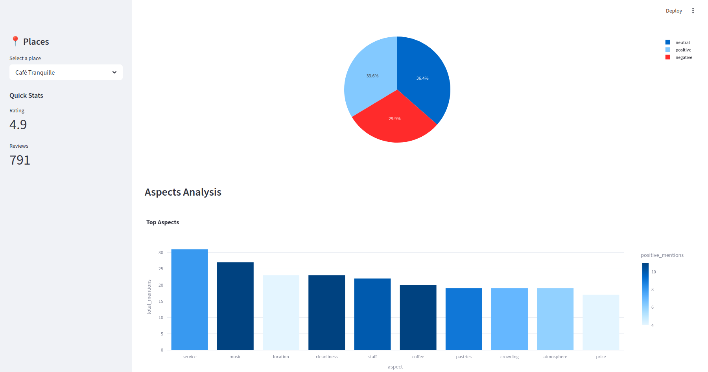

# Google Maps Review Intelligence

## Introduction

Google Maps Review Intelligence is a data pipeline and analytics platform designed to process, analyze, and visualize customer reviews for businesses listed on Google Maps. The platform leverages modern technologies to scrape reviews, analyze sentiment, and provide actionable insights through an interactive dashboard.

The system is designed to help businesses understand customer feedback, identify trends, and improve their services by analyzing review sentiment, extracting key aspects, and summarizing customer opinions.

---

## Tech Stack
- **Scraping:**
  - Camoufox with cirtual display (xvfb)
  - playwright
- **scheduler:**
  - celery
  - redis
  - flower
- **Infrastructure:**
  - Python
  - PostgreSQL + SQLAlchemy
  - Kafka
  - Groq (NLP API)
  - Docker
- **Frontend:**
  - Streamlit
  - Plotly


---

## Project Structure

The project is divided into several components, each responsible for a specific part of the pipeline:

### 1. **Scheduling with Celery and Redis**

- **Purpose**:
  - The scheduling system automates the scraping and processing of reviews at regular intervals.

- **Components**:
  - **Celery**:
    - A distributed task queue used to schedule and execute scraping and processing tasks asynchronously.
    - Tasks include scraping reviews, pushing data to Kafka.
  - **Redis**:
    - Acts as the message broker for Celery, enabling task distribution and coordination.
  - **Flower**:
    - A web-based monitoring tool for Celery tasks, providing insights into task execution and status.

- **Configuration**:
  - The Celery worker and Redis server are configured in the `scheduler/docker-compose.yml` file.
  - Tasks are defined in the `scheduler/tasks.py` file.

- **Workflow**:
  1. Celery schedules scraping tasks at predefined intervals.
  2. Redis queues the tasks and distributes them to Celery workers.
  3. Completed tasks push data to Kafka or update the database.

- **Monitoring**:
  - Flower provides a dashboard to monitor task execution, retry failed tasks, and view task logs.

### 2. **Scraping and Data Ingestion**

- **Kafka**:
  - A Kafka broker is set up to handle the ingestion of review data.
  - The `kafka/docker-compose.yml` file configures the Kafka service and initializes a topic named `reviews` for storing review messages.

- **Input**:
  - Reviews are expected to be pushed to the `reviews` topic in Kafka in JSON format.

---

### 3. **Inference Engine**

- **Purpose**:
  - The inference engine processes reviews from Kafka, performs sentiment analysis, and enriches the data with additional insights.

- **Components**:
  - **`inference_engine/app/inference.py`**:
    - Uses the Groq NLP API to analyze reviews.
    - Extracts overall sentiment, key aspects, main complaints, and generates summaries.
  - **`inference_engine/app/main.py`**:
    - Consumes messages from the Kafka `reviews` topic.
    - Performs inference using the `ReviewAnalyzer` class.
    - Stores the enriched data in the PostgreSQL database.
  - **`inference_engine/app/models.py`**:
    - Defines the database schema for reviews and places using SQLAlchemy ORM.

- **Output**:
  - Enriched review data is stored in the `gm_reviews` table in PostgreSQL.

---

### 4. **Database**

- **PostgreSQL**:
  - The database is configured using Docker (`database/docker-compose.yml`).
  - The schema is initialized using SQL scripts in `database/init/01_init.sql`.
  - Tables:
    - `gm_reviews`: Stores individual reviews with enriched data.
    - `places`: Stores metadata about businesses.
  - Materialized Views:
    - `mv_reviewer_stats`: Aggregates reviewer statistics.
    - `mv_business_stats`: Aggregates business-level review statistics.
    - `mv_business_aspects`: Analyzes aspects mentioned in reviews.

- **Cron Jobs**:
  - A cron job is configured to refresh materialized views daily.

---

### 5. **Dashboard**

- **Streamlit**:
  - The dashboard is implemented using Streamlit (`dashboard/app.py`).
  - Provides an interactive interface for exploring review data.

- **Features**:
  - **Places Overview**:
    - Displays a list of businesses with their ratings and review counts.
  - **Review Analysis**:
    - Shows individual reviews with sentiment and summaries.
    - Allows filtering by sentiment (positive, neutral, negative).
  - **Reviewer Insights**:
    - Displays top reviewers and their statistics.
  - **Analytics**:
    - Visualizes sentiment distribution and aspect analysis using Plotly charts.

- **Queries**:
  - SQL queries for fetching data are defined in `dashboard/queries.py`.
  - The `dashboard/db.py` module handles database connections and query execution.


---

## How It Works

1. **Data Ingestion**:
   - Reviews are pushed to the Kafka `reviews` topic.

2. **Processing**:
   - The inference engine consumes reviews from Kafka.
   - Sentiment analysis and enrichment are performed using the Groq NLP API.
   - Enriched data is stored in the PostgreSQL database.

3. **Analytics**:
   - Materialized views aggregate data for efficient querying.
   - A cron job ensures views are refreshed daily.

4. **Visualization**:
   - The Streamlit dashboard provides an interactive interface for exploring and analyzing the data.

---

## Getting Started

### Prerequisites

- Docker and Docker Compose
- Python 3.11

### Setup

1. Clone the repository:
   ```bash
   git clone <repository-url>
   cd Google-Maps-review-intelligence